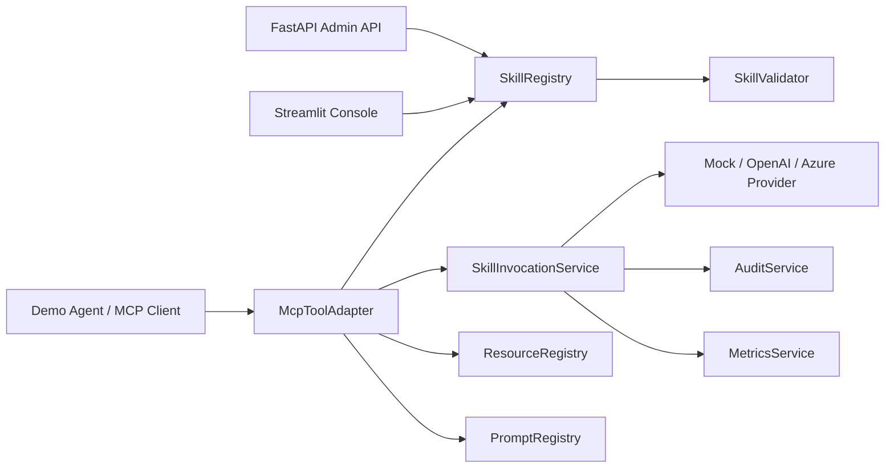

Enterprise teams duplicate AI automations because reusable skills are hard to govern, validate, audit, and safely expose to agents.

Enterprise MCP Skill Hub is a locally runnable FastAPI and MCP-compatible skill layer where approved AI capabilities are registered by manifest, discovered dynamically, invoked with schema validation, and monitored with audit and usage telemetry.

## 30-Second Demo

```bash
python -m pip install -r requirements-dev.txt
python -m app.demo
python -m app.evals.run_eval
python -m uvicorn app.main:app --reload
```

In another terminal:

```bash
curl -X POST http://localhost:8000/auth/demo-token
curl -H "X-API-Key: dev-local-token" http://localhost:8000/mcp/tools
```

Dashboard:

```bash
python -m streamlit run dashboard/streamlit_app.py
```

Windows PowerShell equivalents work with the same `python -m ...` commands. If `make` is available, use:

```bash
make install
make test
make dev
make mcp
make dashboard
make demo
make validate-skills
make eval
```

## Architecture



## What This Demonstrates

- Model Context Protocol concepts: tools, resources, prompts, discovery, and invocation.
- Reusable agent skills with YAML manifests, input/output schemas, versioning, and enabled status.
- Dynamic tool discovery where disabled skills disappear from MCP tool listings.
- FastAPI reference APIs for registration, validation, invocation, metrics, and audit logs.
- Prompt and context engineering through reusable prompt templates and governed resource exposure.
- Token usage, latency, cost estimates, trace IDs, structured audit events, and failure metrics.
- Provider adapters for deterministic mock mode plus optional OpenAI and Azure OpenAI paths.
- Enterprise handoff docs for full-stack and DevOps teams.

## Built-In Skills

- `summarize_document`
- `extract_entities`
- `translate_text`
- `classify_request`
- `generate_action_items`
- `search_knowledge_base`

Each built-in skill has a manifest under `sample_data/manifests/`, deterministic mock behavior, and tests.

## Screenshots

Run the dashboard and capture these views for portfolio use:

1. Skill Catalog
2. Invoke Skill
3. Demo Agent
4. MCP Inspector
5. Metrics
6. Audit Events

The first screen is the usable admin console, not a marketing page.

## Local API

The API uses simple demo API-key auth. Get the token:

```bash
curl -X POST http://localhost:8000/auth/demo-token
```

Invoke a skill:

```bash
curl -X POST http://localhost:8000/skills/classify_request/invoke \
  -H "Content-Type: application/json" \
  -H "X-API-Key: dev-local-token" \
  -d "{\"input\":{\"request\":\"Security review is blocking the RFP.\"}}"
```

## Project Layout

```text
app/                 FastAPI app, services, MCP adapter, providers, evals
dashboard/           Streamlit admin console
docs/                Architecture, API, MCP, manifest, evaluation, Azure notes
sample_data/         Fake manifests, policies, product docs, and demo inputs
tests/               Pytest coverage for governance, MCP, metrics, auth
typescript-bridge/   Optional Zod-to-MCP-compatible JSON schema example
```

## Provider Modes

Default local mode is deterministic and free:

```bash
LLM_PROVIDER=mock
```

Optional providers are configured through `.env`:

```bash
LLM_PROVIDER=openai
OPENAI_API_KEY=...
```

```bash
LLM_PROVIDER=azure_openai
AZURE_OPENAI_API_KEY=...
AZURE_OPENAI_ENDPOINT=...
AZURE_OPENAI_DEPLOYMENT=...
```

Mock mode remains the expected path for interviews, CI, and fresh clones.
